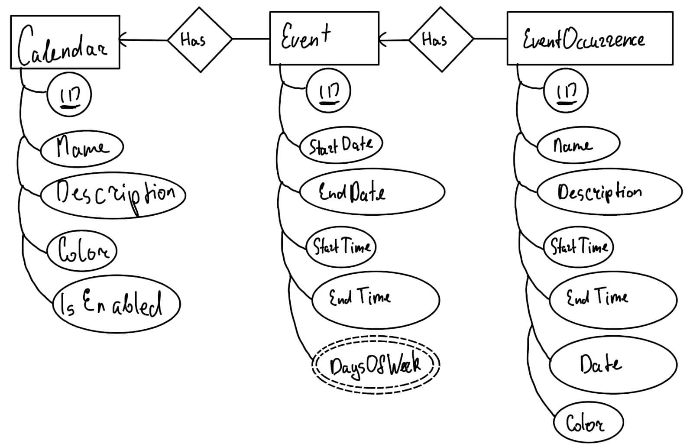
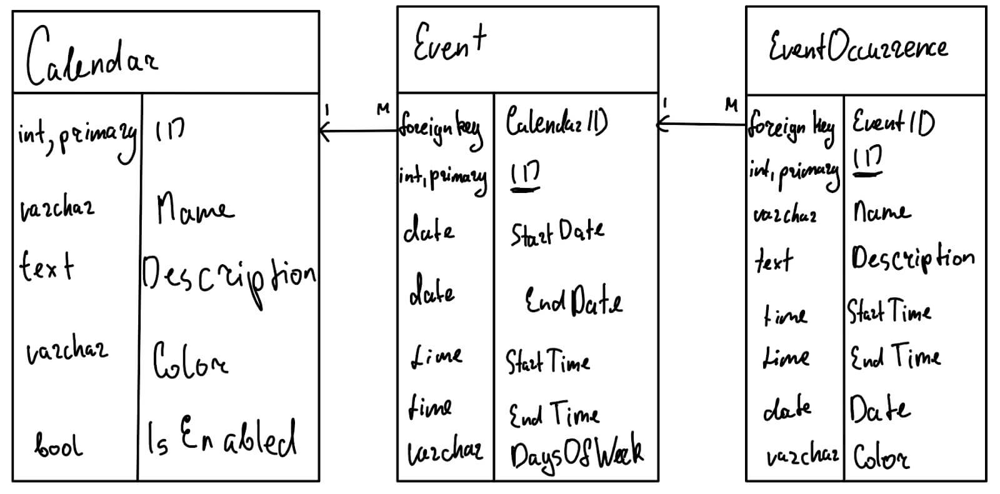

# Project: Ephemeris

A full-fledged calendar application with support for multiple calendars,
repeated events and best of all, dark mode. It has four view modes: year, month,
week and day. Additionally, there is good screen reader and keyboard navigation
support.

Build with React, Next.js and Tailwind. Uses MySQL/MariaDB for storage.

[Online demo](https://project-ephemeris.vercel.app)

[Project documentation, video overview and screenshots](https://max.patii.uk/projects/project-ephemeris)

## Configuration

Ephemeris requires a MySQL/MariaDB connection to store calendars and events.

To configure a connection, create an `.env.local` file in the root directory
with the following content (replace placeholder values with your credentials):

```js
MYSQL_USERNAME=<username>
MYSQL_PASSWORD=<password>
MYSQL_HOST=<hostname>
MYSQL_DATABASE=<database>
```

Then, create a database with name that matches your `MYSQL_DATABASE` setting
and import its schema from `./schema.sql`.

## Development

```zsh
npm i       # install dependencies
npm run dev # start development server
```

This would start the development server at
[http://locahlost:3000](http://locahlost:3000).

## Production

```zsh
npm i         # install dependencies
npm run build # begin the build process
npm run start # start production server
```

This would start the production server at
[http://locahlost:3000](http://locahlost:3000).

Afterward, you can deploy this site at [https://vercel.com](https://vercel.com).

Alternatively, you can configure a reverse proxy (e.x Nginx) that would handle
the SSL certificate and forward the requests to port 80, which should be made
externally available.

## Origin of the name

The name “Ephemeris” is an archaic word in astronomy that stands for a book with
tables that gives the trajectory of naturally occurring astronomical objects as
well as artificial satellites in the sky.

## Database

Database schema is located in `./schema.sql`.

### Conceptual design



#### Constraints

- Each event belongs to a single calendar
- Event start date is before event end date
- Event start time is before event end time
- Event occurs on at least 1 day of the week, but no more than 7
- Each event may have one or more occurrences
- Event occurrence start time is before event end time
- Event occurrence start time and end time may differ from that of event (to
  handle cases when an individual event is delayed or rescheduled)
- Event occurrence’s date is between the start date and end date of the event
- Event occurrence has a color, which may differ from that of the calendar

### Logical design



- No weak entry sets were used.
- Each record in every table has a single unique primary key and no other
  candidate keys.
- Event.StartTime and Event.StartTime may be redundant as that information is
  also stored in the EventOccurrence. However, this information is needed to
  create more EventOccurrences if Event.EndDate is pushed back into the future.
- Similarly, Event.DaysOfWeek shows the days on which repeated events are
  occurring. This is a derived multi-value attribute. This information can be
  extracted from all the EventOccurrence.Date attached to a particular Event,
  but that action may be computationally expensive, thus that derived attribute
  is stored in Event. When converting from ER diagram to logical design, I
  considered turning that attribute into a separate table, but that seemed like
  overkill since there would only be 2 attributes in that table (EventID and
  DayOfWeek). Thus, I decided to store days of the week as a single string value
  like this: “MTWHFSU” (abbreviation for weekday names from Monday to Sunday).
- Calendar, Event and EventOccurrence tables are in Boyce–Codd normal form.

### Time accounting

It took 35 hours and 45 minutes spread out over several weeks to complete the
project.

I felt like I was almost finished at the 20-hour mark, but lots of new issues
just kept coming up. Additionally, writing the video script, recording material,
practicing reading the script, recording voice, and editing all that material
together into a video took about 6 hours.

## Remarks

I am a Google Calendar power-user, which is why I wanted to understand closer
how it works. There is no better way to do that than try to reimplement it from
scratch. In the process, I discovered several edge cases and found solutions to
those. It gave me a new appreciation for the challenges of building a web
calendar, like handling time zones, figuring out the algorithm for placement of
events on the grid, and improving performance through caching events for already
fetched days.

## Code Credit

Majority of the start code was repurposed and reused from another project of
mine:
[max.patii.uk (my portfolio)](https://github.com/maxpatiiuk/max.patii.uk/).

Additionally, many basic React components and utility functions have been
repuposed from another project I am a working on:
[Specify 7](http://github.com/specify/specify7) (scientific collection
management system).
