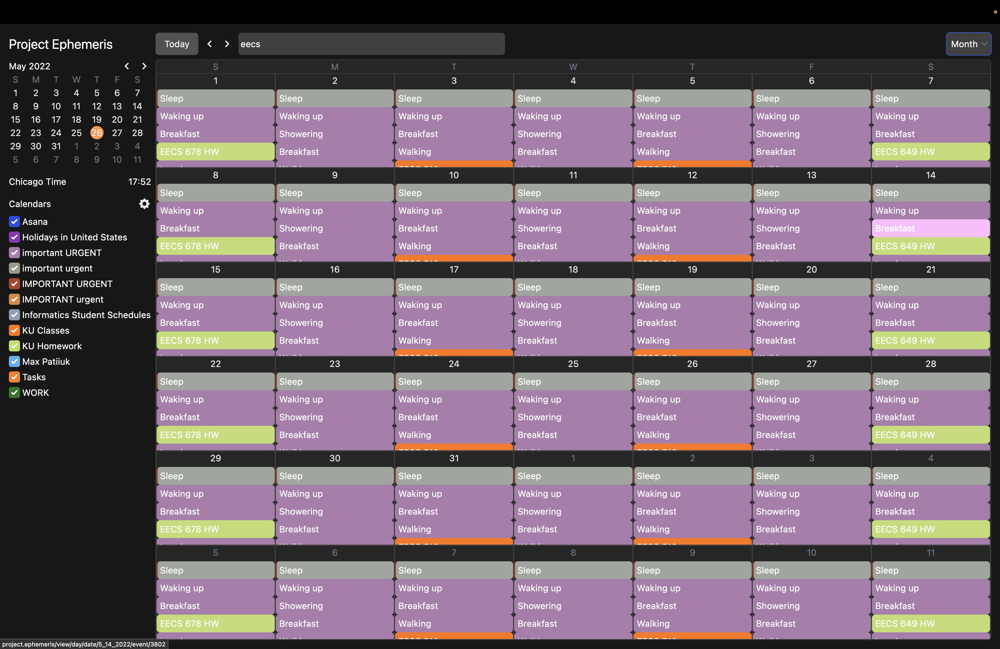
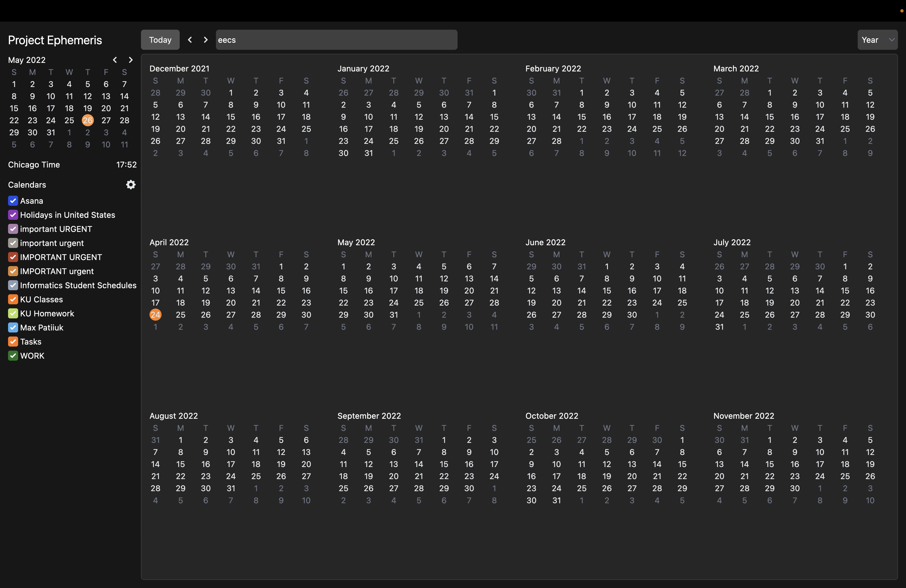
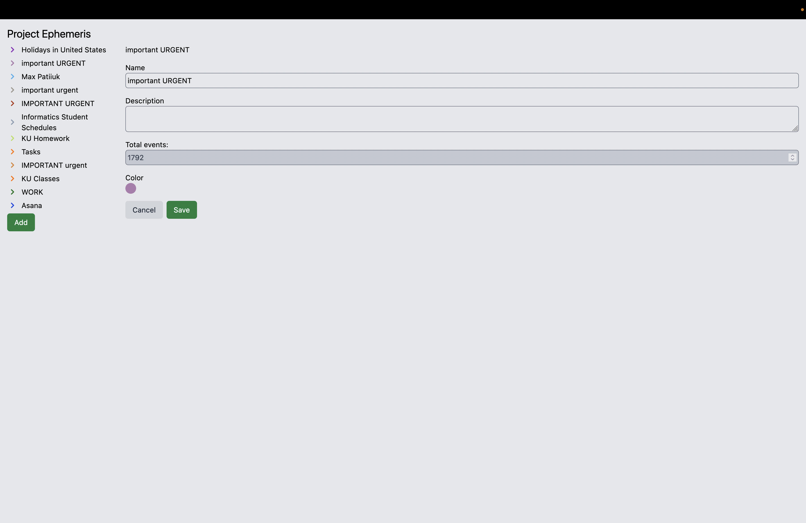

# Project: Ephemeris

A full-fledged calendar application with support for multiple calendars,
repeated events and best of all, dark mode. It has four view modes: year, month,
week and day. Additionally, there is good screen reader and keyboard navigation
support.

Build with React, Next.js and Tailwind. Uses MySQL/MariaDB for storage.

## Screenshots

Main page:


Editing an event


Searching for events:


Month view:



Year view:



Light mode:


Editing calendar:



## Configuration

Ephemeris requires a MySQL/MariaDB connection to store calendars and events.

To configure a connection, create an `.env.local` file in the root directory
with the following content (replace placeholder values with your credentials):

```js
MYSQL_USERNAME=<username>
MYSQL_PASSWORD=<password>
MYSQL_HOST=<hostname>
MYSQL_DATABASE=<database>
```

Then, create a database with name that matches your `MYSQL_DATABASE` setting
and import its schema from `./schema.sql`.


## Development

```zsh
npm i       # install dependencies
npm run dev # start development server
```

This would start the development server at
[http://locahlost:3000](http://locahlost:3000).

## Production

```zsh
npm i         # install dependencies
npm run build # begin the build process
npm run start # start production server
```

This would start the production server at
[http://locahlost:3000](http://locahlost:3000).

Afterward, you can deploy this site at [https://vercel.com](https://vercel.com).

Alternatively, you can configure a reverse proxy (e.x Nginx) that would handle
the SSL certificate and forward the requests to port 80, which should be made
externally available.

## Code Credit

Majority of the start code was repurposed and reused from another project of
mine: [max.patii.uk (my portfolio)](https://max.patii.uk).

Additionally, many basic React components and utility functions have been
repuposed from another project I am a  working on:
[Specify 7](http://github.com/specify/specify7) (scientific collection
management system).

## Origin of the name

The name “Ephemeris” is an archaic word in astronomy that stands for a book with
tables that gives the trajectory of naturally occurring astronomical objects as
well as artificial satellites in the sky.